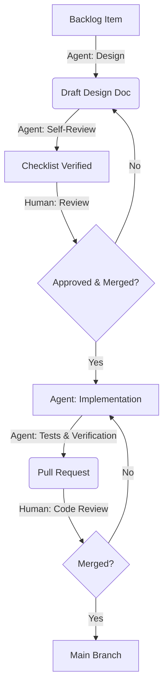

# GitHub Strategy for Multi-Agent Collaboration

## Overview
This document defines the collaboration workflow for the **LinkLens** project, where multiple AI agents work autonomously on design and implementation tasks alongside human oversight.

## Goals
*   **Safety:** Prevent broken code from reaching production.
*   **Clarity:** Clear handoffs between Design and Implementation phases.
*   **Autonomy:** Allow agents to work independently on assigned tasks without blocking each other.
*   **Human Control:** Explicit gates where human approval is required.

## Workflow: The "Design-First" Cycle

Every roadmap item follows this strict lifecycle:

### Core Mandates
1.  **Single-Issue Focus:** Each Pull Request MUST address exactly one issue. Combining multiple features, bug fixes, or administrative tasks (like rebranding) into a single PR is strictly prohibited.
2.  **Atomic Changes:** If a task requires changes across multiple domains (e.g., rebranding and a new feature), they must be split into separate issues and separate PRs.
3.  **Design-Implementation Separation:** Coding (Implementation Phase) must NEVER begin until a corresponding Design Pull Request has been reviewed and MERGED into `main`.

### 1. Branching Strategy

We use a **Feature Branch** workflow.

*   **`main`**: The protected, deployable state of the product. Direct commits are blocked.

*   **`feat/issue-ID-description`**:

 For implementation tasks (e.g., `feat/13-rate-limiter`).
*   **`design/issue-ID-description`**: For design tasks (e.g., `design/12-github-strategy`).
*   **`fix/issue-ID-description`**: For bug fixes.

### 2. The Two-Phase Commit Rule
To enforce the "Design-First" mandate, complex features require **two separate Pull Requests**:

#### Phase A: Design PR
*   **Content:** Markdown files in `docs/` (e.g., `docs/DESIGN_RATE_LIMITER.md`).
*   **Mandatory:** Verify against `docs/DESIGN_REVIEW_CHECKLIST.md` before opening PR.
*   **Goal:** Define *what* we are building and *how*.
*   **Review:** Human checks strictly for architectural soundness and product alignment.
*   **Merge:** Merging this PR signals approval to start coding.

#### Phase B: Implementation PR
*   **Content:** Code changes (`.go`, `.ts`), tests, and config.
*   **Reference:** Must link to the approved Design PR/Issue.
*   **Goal:** Deliver working software that matches the design.
*   **Review:** Human checks code quality, test coverage, and security.

### 3. Human-in-the-Loop Options

We support three levels of human intervention, configured per-repo or per-agent capability:

| Level | Description | Best For |
| :--- | :--- | :--- |
| **1. Post-Hoc Review** | Agent commits directly to `main`. | *Documentation updates, minor tweaks.* |
| **2. PR Gate (Default)** | Agent opens PR, waits for human merge. | *Standard features, bug fixes.* |
| **3. Approval Gate** | Agent pauses *before* starting implementation to get plan approval. | *Architectural changes, new product features.* |

**Current Configuration:** **Level 2 (PR Gate)** is the default for all code changes.

### 4. Conflict Resolution
*   **Rebase First:** Agents should rebase their feature branch on `origin/main` before opening a PR.
*   **Force Push (Lease):** If a rebase is required, use `--force-with-lease`.
*   **Stale Branches:** If a branch is inactive for >7 days and conflicts, it should be archived or deleted.

## Automation & CI Checks
To support this workflow, the following GitHub Actions are recommended:
1.  **Design Check:** Ensure `docs/*.md` exists for new `feat/*` branches (Optional linter).
2.  **Test Suite:** Run `make test` on every push to `feat/*` and `fix/*`.
3.  **Lint:** Run `golangci-lint` and `eslint`.

## Agent Guidelines
1.  **Read the Roadmap:** Always check `docs/PRODUCT_ROADMAP.md` before starting.
2.  **Link Issues:** Use "Fixes #12" in PR descriptions.
3.  **Self-Correction:** If CI fails, the agent must fix the errors in a new commit on the same branch.
